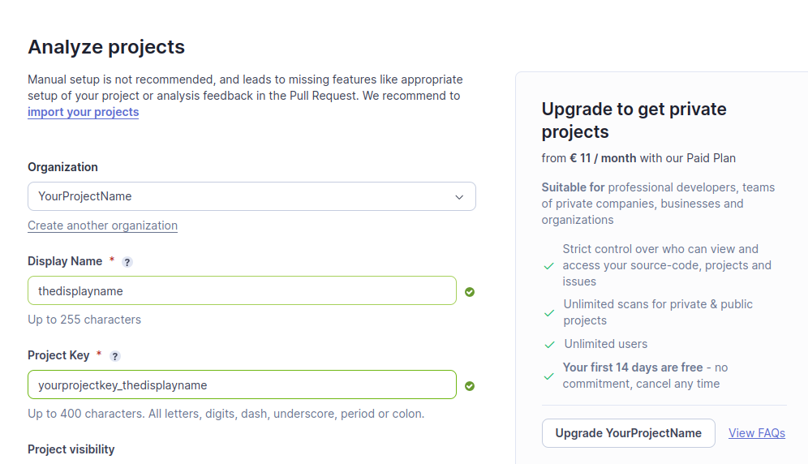
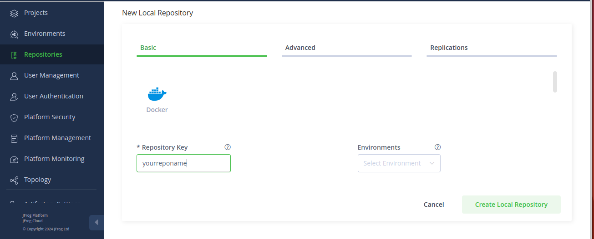
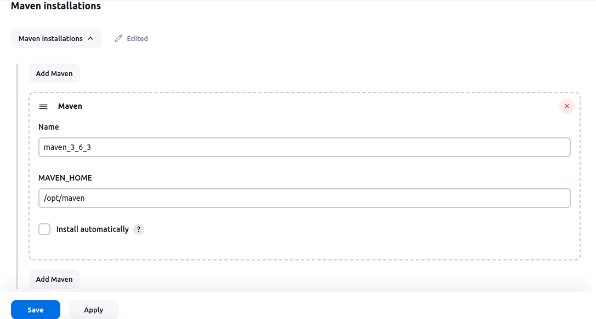
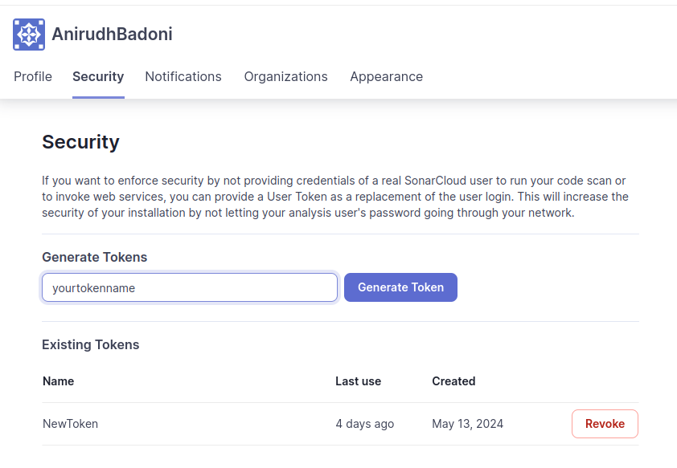
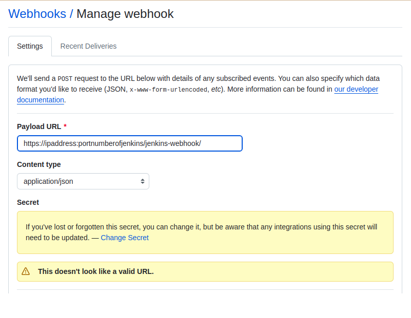
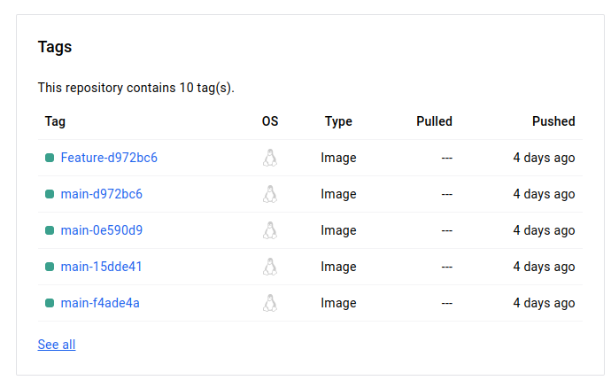

# Containerizing a Java Application and Implementing a CI/CD Pipeline

  
Architecture

  

Steps followed to create the project

 

Create GitHub repository
 
We will create a GitHub repository for Part One. This repository will serve as a central hub for developers to easily interact with the               project and manage their contributions. It will also provide a solid anchor for our Jenkins pipeline, ensuring smooth integration and                 continuous deployment processes. By utilizing GitHub, we promote collaboration, version control, and transparency within the team,                    enhancing overall productivity and project management.   
clone this repo: https://github.com/spring-projects/spring-petclinic

   

Setup the Sonarcloud
 
1. Go to sonarcloud.io    
2. Login with GitHub    
3. Create a new Organisation  
  
  Then click on Create Organisation  
4. Create a Project. 
   
  Follow the setup and then click on Create Project.
5.

Setup the Jfrog
 
1. Go to Jfrog.io    
2. Login with Username and Password 
   make sure to save the username and password as we will need them as credentials in future steps.   
3. Go to Administration on the main page>>Repositories>>create repository>>local>>docker>>repositoryname>>click on create repo 
    
4. Copy the URL and click on set up docker client>> Give the token name and follow the steps in the ec2 created. 
    
5. Create a Project. 

Launch an ec2
 
We will create an EC2 instance on AWS and set up the project there. This way, the project setup won’t interfere with our local machines, and our      local setups won’t affect the project. By isolating the environment, we ensure a clean and consistent setup for everyone involved, making it easier to manage dependencies and configurations. Additionally, this approach allows for better scalability and flexibility as we can easily         replicate the environment or scale resources as needed.  

1. Install Jenkins on the Instance.  
<pre><code>  
sudo apt update
sudo apt install openjdk-11-jdk
java --version
wget -p -O - https://pkg.jenkins.io/debian/jenkins.io.key | sudo apt-key add -
sudo sh -c 'echo deb http://pkg.jenkins.io/debian-stable binary/ > /etc/apt/sources.list.d/jenkins.list'
sudo apt update
sudo apt install jenkins
sudo systemctl status jenkins
sudo systemctl start jenkins
</code> </pre> 
2. Install Maven on the Instance.  
<pre><code> 
$ wget https://mirrors.estointernet.in/apache/maven/maven-3/3.6.3/binaries/apache-maven-3.6.3-bin.tar.gz
$ tar -xvf apache-maven-3.6.3-bin.tar.gz
$ mv apache-maven-3.6.3 /opt/
M2_HOME='/opt/apache-maven-3.6.3'
PATH="$M2_HOME/bin:$PATH"
export PATH
$ mvn -version
Apache Maven 3.6.3 (cecedd343002696d0abb50b32b541b8a6ba2883f)
Maven home: /opt/apache-maven-3.6.3
Java version: 13.0.1, vendor: Oracle Corporation, runtime: /opt/jdk-13.0.1
Default locale: en, platform encoding: UTF-8
OS name: "linux", version: "4.15.0-47-generic", arch: "amd64", family: "unix"
</code> </pre> 

Integrating maven with Jenkins
 
1. Go to Jenkins Dashboard >> Manage Jenkins >> tools >> Maven Installation >> Add Maven 
2. either opt for install automatically or give the name and path of the maven in your ec2 for reference which could later be called in the Jenkins pipeline.
   

Integrating SonarCloud with Jenkins
 
1. Go to SonarCloud Dashboard >> Account ID >> My Account >> Security >> Generatetoken 
2. Copy the code and paste it into the pipeline.
    

Integrating Github with Jenkins with the help of webhooks
 
1. Go to GitHub Dashboard >> Repository >> Settings >> webhook 
2. fill the payload URL as https://localhost:portnumber/jenkins-webhook/ , content type 
3. Click on Update webhook 
  

**Note:** We have used Ngrok to serve as a server proxy as my instance is running in localhost and is not accessible by the internet.
  

Jenkins File
 

Path to the Jenkinsfile file: <a href = "./Jenkinsfile"> Jenkinsfile</a>

  

  
Launch Jenkins and Create a Pipeline with the following stages
 
  
Path to the Provisioner file: <a href = "./Jenkinsfile"> Jenkinsfile</a>

  Steps followed: 
    1. Create a Jenkins job with the following configurations:  
      &nbsp;a. Item Type: Multibranchpipeline 
      &nbsp;b. Branch Source: Git, give your git repo URL, Property strategy: all branches get the same properties, Build Configuration: 
      Jenkinsfile, 
      Scan Multibranch Pipeline Trigger: scan by webhook, give the trigger token and follow the steps in github  
    2. Install the following plugins: GitHub Plugin, GitHub Branch Source Plugin,Pipeline Plugin, Multibranch Pipeline Plugin, SonarQube Scanner 
    Plugin, JFrog Artifactory Plugin, Docker Plugin, Docker Pipeline Plugin:  
    3. Creta a credential in Jenkins to store the  AWS access key and secret key as username and password also pass the ID, similarly for docker and 
   jfrog   
    4. Build the pipeline if no errors occur we will be able to find an ami in the location specified.
    
  

  

  
Check for the Docker image in Docker Hub as well as Jfrog Consoles
 
     we will be able to find the docker image with the branch and commit ID as a tag.
     
     
    
  

 
  

Reference to the other parts of the Parts.
|[Part 0](https://github.com/AnirudhBadoni/ProjectOne.git)|[Part 1](https://github.com/AnirudhBadoni/Packer.git)|[Part 3](https://github.com/AnirudhBadoni/AwsInfra.git)|
|---|---|---|
